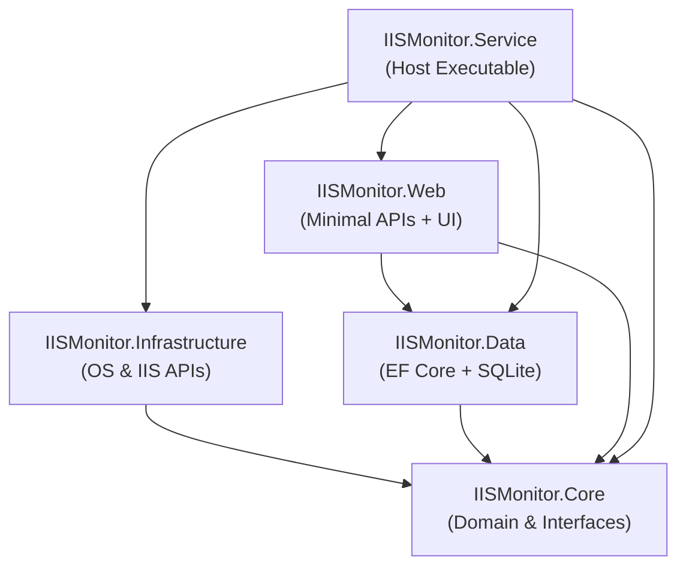
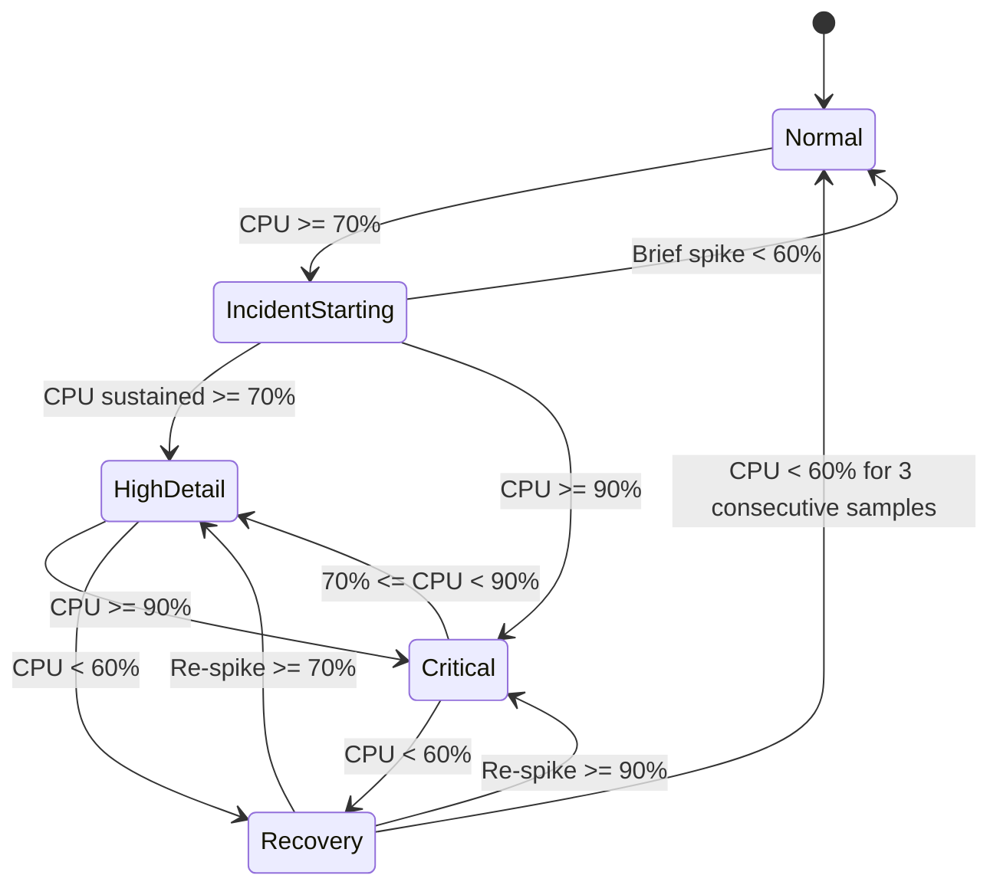

# Architecture Document: IIS Root-Cause Monitoring Agent

## 1. System Overview

The **IIS Root-Cause Monitoring Agent** is an autonomous, on-host Windows Service built in C# on .NET 8. It continuously monitors Windows IIS web servers hosting ~25 websites per server to automatically identify the root cause of intermittent CPU spikes that occur every 2–3 days.

The agent operates on a fundamental principle: **Collect evidence first, recover second.**

```text
                    Windows Server
                         │
        ┌────────────────┴────────────────┐
        │                                 │
        │        Monitoring Service       │
        │        Windows Service          │
        │                                 │
        │  ┌───────────────────────────┐  │
        │  │ Monitoring Scheduler      │  │
        │  │ 30s Normal / 5s Incident  │  │
        │  └─────────────┬─────────────┘  │
        │                │                │
        │        CPU < 70%                │
        │                │                │
        │        Rolling Baseline Buffer  │
        │        (Last 60 Minutes)        │
        │                │                │
        │        CPU >= 70%               │
        │                │                │
        │        High-Detail Capture Mode │
        │                │                │
        │                ▼                │
        │             SQLite              │
        │             (WAL Mode)          │
        │                ▲                │
        │                │                │
        │        ASP.NET Core Kestrel     │
        │        localhost:5050           │
        │                                 │
        └─────────────────────────────────┘
```

---

## 2. Component Structure

The solution follows Clean Architecture with strict separation of concerns:

```
src/
├── IISMonitor.Core/           # Pure domain models, enums, interfaces, circular buffer, state machine
├── IISMonitor.Infrastructure/ # Windows Performance Counters, MWA IIS APIs, ProcDump, Event Log, Task Scheduler
├── IISMonitor.Data/           # EF Core + SQLite DbContext, WAL interceptor, channel batch writer
├── IISMonitor.Web/            # ASP.NET Core Minimal APIs, SSE live feed, static SPA dashboard
└── IISMonitor.Service/        # Composition root, WindowsServiceLifetime host, background workers
```

### Dependency Flow



---

## 3. CPU State Machine & Hysteresis

The monitoring engine enforces a 5-state CPU state machine to prevent flapping:



### Anti-Flapping Rules
1. **Trigger Threshold**: CPU $\ge$ 70% transitions from `Normal` $\to$ `IncidentStarting`.
2. **Hysteresis Band**: Between 60% and 70%, the engine remains in the current incident mode.
3. **Recovery Exit Condition**: Requires **3 consecutive samples** below 60% before returning to `Normal`.

---

## 4. Rolling Baseline Buffer Pattern

Rather than collecting nothing when CPU is normal, the agent continuously samples lightweight metrics every 30 seconds into an in-memory `CircularBuffer<MonitoringSample>` (capacity 120 = 60 minutes).

When an incident triggers:
1. The rolling baseline is promoted into SQLite linked to the new `IncidentId`.
2. Forensic investigators have visibility into the 30–60 minutes **immediately prior** to the spike.

---

## 5. IIS Worker Process Mapping Across Recycles

A primary challenge on IIS is that worker processes recycle, changing their Process ID (PID).
The agent solves this by:
1. Enumerating `Microsoft.Web.Administration.ServerManager.WorkerProcesses` (with `appcmd list wp /xml` fallback).
2. Maintaining historical records in `ProcessMappings`:
   ```text
   PID 15432  ->  PatientPortalPool  ->  patient.example.com  (Started: 10:15, Ended: 14:32)
   PID 18904  ->  PatientPortalPool  ->  patient.example.com  (Started: 14:32, Active)
   ```
3. Correlating historical incident PIDs even after an application pool recycles.

---

## 6. SQLite Database Architecture

- **Engine**: SQLite with Write-Ahead Logging (`PRAGMA journal_mode = WAL;`) and `PRAGMA synchronous = NORMAL;`.
- **Concurrency**: Single writer via `System.Threading.Channels.Channel<MetricWriteBatch>`, with a dedicated background writer flushing batches of up to 50 items or every 3 seconds inside single transactions.
- **Indexes**:
  - `MetricSamples(TimestampUtc)`, `MetricSamples(IncidentId)`
  - `ProcessSamples(TimestampUtc, ProcessId)`, `ProcessSamples(IncidentId)`, `ProcessSamples(ProcessName)`
  - `ApplicationPoolSamples(TimestampUtc, AppPoolName)`, `ApplicationPoolSamples(IncidentId)`
  - `Incidents(StartTimeUtc)`, `Incidents(Status)`
  - `IncidentFingerprints(FingerprintHash)`

---

## 7. Automated Recovery Safeguards

When configured (disabled by default), the agent can recycle an application pool causing sustained server failure:

```text
Server CPU >= 90%
       │
       ▼
Sustained for >= 5 continuous minutes?
       │  YES
       ▼
Is top process w3wp.exe?
       │  YES
       ▼
Is worker process consuming >= 70% CPU?
       │  YES
       ▼
Are multiple pools consuming high CPU?
       │  NO (Only single culprit)
       ▼
Check cooldown (30 min) & hourly limits (max 1/hr, 3/day)
       │  PASSED
       ▼
Capture forensic diagnostic dump (ProcDump)
       │
       ▼
Final check: CPU still >= 90%?
       │  YES
       ▼
Recycle ONLY the culprit Application Pool (ServerManager.Recycle())
       │
       ▼
Verify recovery at 30s, 60s, 120s, 300s
```
